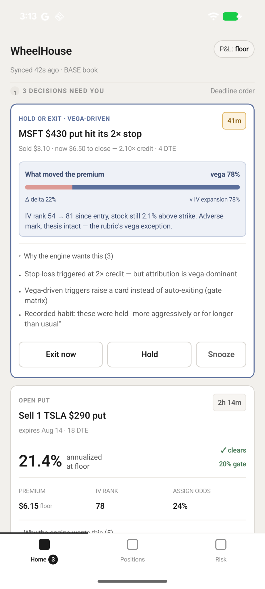
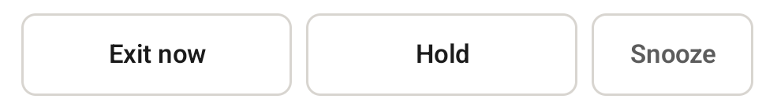
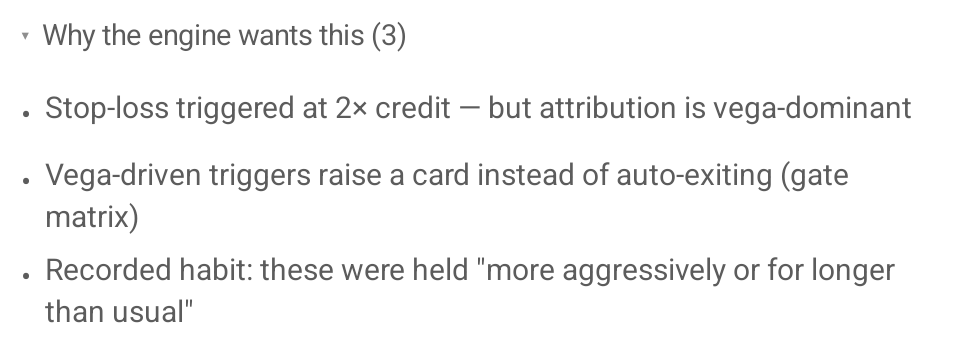
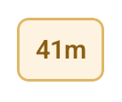

## The experiment

Does Claude build apps that are accessible out of the box? I decided to find
out. I asked Claude to build a new app and then evaluated one user flow for
accessibility. I deliberately didn’t ask Claude to make the app accessible. I
wanted to see what accessibility issues would exist in an otherwise functional
AI-generated application.

I audited one user flow for [WCAG 2.2](https://www.w3.org/TR/WCAG22/) AA
compliance. WCAG, or Web Content Accessibility Guidelines, are internationally
recognized guidelines for making digital content accessible. For my audit, I
used several assistive technologies and tools, including TalkBack, Android’s
screen reader.

A few notes:

- The app isn’t production-ready. The visual designs could use improvement, and
  I implemented only mock APIs.
- I only tested one user flow. I didn’t conduct a comprehensive audit of the
  entire app. (I did see some of the issues discussed below in other flows).
- I built the flow I tested with Claude Sonnet 5 using Claude Code. The app is
  written in Kotlin with Jetpack Compose.
- This article focuses on identifying accessibility issues, not on asking Claude
  to remediate them. I’m considering that as a follow-up experiment.
  [This pull request](https://github.com/carmenvkrol/wheelhouse-android-app/pull/1)
  includes my accessibility fixes. Claude wrote the commit and PR summaries.
- The app, called “WheelHouse”, is for
  [options trading](https://www.nerdwallet.com/investing/learn/options-trading-definitions).
  It is an app idea from [Patrick Dowell](https://github.com/patrick-dowell/).
  [This GitHub repo](https://github.com/carmenvkrol/wheelhouse-android-app/)
  contains only the code relevant to the flow discussed in this article because
  the app is still in an early stage. The main branch contains the initial
  implementation, and the accessibility fixes are documented in
  [the pull request](https://github.com/carmenvkrol/wheelhouse-android-app/pull/1).

## How I built the flow with Claude

I purposely didn’t prompt Claude to consider accessibility while developing the
Wheelhouse Android app. With
[architecture requirements](https://github.com/carmenvkrol/wheelhouse-android-app/blob/main/android/REQUIREMENTS.md)
provided by Patrick, I asked Claude to develop the design requirements and
wireframes. Once Claude created
[the wireframes](https://github.com/carmenvkrol/wheelhouse-android-app/blob/main/android/design/wireframes.html)
and Patrick confirmed they reflected all the functional requirements, I asked
Claude to build each screen in the wireframes.

## What was audited for accessibility

For this article, I tested only 1 flow against all WCAG 2.2 AA criteria. I used
a checklist I created for professional audits. I tested with TalkBack, an
external keyboard, the
[WebAIM color contrast checker](https://webaim.org/resources/contrastchecker/),
and without any assistive technologies. I might go into my checklist and testing
strategy more in a future article.

The flow I tested was responding to a pending proposal — the "Hold or Exit ·
Vega-Driven" card shown in the screenshot below. The app's automatic sell rule
has fired on a position, but the app's own analysis suggests the loss stems from
a spike in market volatility (what option traders call “vega”) rather than a bad
trade. Instead of acting automatically, the app asks the user to decide, with a
deadline. You don't need to understand options trading to follow the
accessibility findings below.

## What I found

Of the 24 applicable WCAG AA criteria for this flow, 15 passed and 9 failed.
Rather than walk through all nine failures, I’m highlighting three findings that
stood out to me and illustrate the accessibility issues I encountered in the
flow.

### #1 Accessibility semantics weren’t implemented correctly

This category stood out to me because I found several examples of missing or
incorrectly implemented accessibility semantics. It wasn’t always obvious from
the code that something was wrong; I had to confirm it with a screen reader.

Assistive technology users rely on semantics to understand an element's purpose
and how to interact with it.

I’m highlighting one example that wasn’t evident from the code, along with two
other semantic issues I found in the same flow.

#### What I found

Claude added an accessible button role, but TalkBack didn’t announce it. The
problem stemmed from how Android’s
[AccessibilityNodeInfo](https://developer.android.com/reference/android/view/accessibility/AccessibilityNodeInfo)
hierarchy inherits accessibility properties.

#### Why it matters

Because TalkBack didn’t announce the element as a button, TalkBack users might
not know how to interact with it.

#### Fix

Use a
[button component](https://developer.android.com/develop/ui/compose/components/button)
instead of setting the role on a
[text component](https://developer.android.com/develop/ui/compose/text). More
details in
[this PR](https://github.com/carmenvkrol/wheelhouse-android-app/pull/1/changes/c0265737a0a8e3ceef7c9856e706488e2bf19336).

#### Other semantic issues in the same flow

I also discovered a couple of other accessibility semantic issues.

When using TalkBack, a bulleted list didn’t announce each item’s position. For
example, we’d expect the list item that begins with “Vega-driven triggers” to
announce with “2 of 3”. Without this item’s position, TalkBack users didn’t get
the same information about the items’ relationship that was conveyed visually.
Use the
[CollectionInfo](https://developer.android.com/reference/kotlin/androidx/compose/ui/semantics/CollectionInfo)
and
[CollectionItemInfo](https://developer.android.com/reference/kotlin/androidx/compose/ui/semantics/CollectionItemInfo)
properties, which provide assistive technologies with placement information.
More details in
[this PR](https://github.com/carmenvkrol/wheelhouse-android-app/pull/1/changes/7d1ab94fad0595192783747094615e40cc7a2bd0).

In another case, an expandable button had its “expanded” and “collapsed” states
added to its label instead of its state property. Including states in the label
can confuse assistive technology users. If a state isn’t exposed through the
correct property, the element may also behave incorrectly. To fix this issue,
[clearAndSetSemantics](https://developer.android.com/reference/kotlin/androidx/compose/ui/semantics/clearAndSetSemantics.modifier)
should be used on the parent element that includes the stateDescription. It is
included in
[this PR](https://github.com/carmenvkrol/wheelhouse-android-app/pull/1/changes/9177a97e5c856f741c542181d48abe46aa51a4fe).

### #2 Text didn’t meet color contrast requirements

This failure stood out because it is a straightforward visual accessibility
issue and relatively easy to test programmatically.

#### What I found

Using the
[WebAIM color contrast checker](https://webaim.org/resources/contrastchecker/),
I found that the subtext below the heading didn’t meet color contrast
requirements.

The text had a contrast ratio of 3.27:1, which is below the WCAG 2.2 AA
requirement of 4.5:1 for normal-sized text.

#### Why it matters

When color contrast isn’t high enough, people with visual impairments have a
harder time reading content.

#### Fix

The fix involves updating text and background colors with a sufficient contrast
ratio, which can be verified with the WebAIM color contrast checker.

### #3 Unhandled abbreviation

This issue stood out because I’ve encountered it often. It’s trickier to detect
because it requires understanding the page context and whether the text is used
as an abbreviation.

#### What I found

The app displayed “41m” to indicate that 41 minutes remained to make a decision.
TalkBack announced it as “41 meters” because it interpreted “m” as meters.

#### Why it matters

A TalkBack user could be confused about what “41m” means and miss important
information about how much time they have to make a decision.

#### Fix

Provide a full accessibility label such as “41 minutes remaining”. This can be
added to the element’s contentDescription. More details in
[this PR](https://github.com/carmenvkrol/wheelhouse-android-app/pull/1/changes/9cbce9aa7ee4673800c15e82b9b28dc838893493).

## What does this mean for developers using AI?

These examples show that we can’t assume AI-generated code has been adequately
evaluated for accessibility. The issues described in this article are also
mistakes I regularly see in human-written code.

Developers using AI coding tools should treat accessibility as part of the
development feedback loop, using automated checks, code review, and assistive
technology testing rather than assuming the generated code has been adequately
evaluated. As AI makes it easier to generate software, integrating accessibility
evaluation into that loop becomes increasingly important.

## Next topic

I’m considering a few follow-up experiments:

1. I asked Claude to fix the accessibility issues I found. How well did it do?
2. Can AI actually test an Android app for accessibility?
3. How does accessibility compare between Fable and Astra?

I plan to write about #1 next. However, if you’d prefer #2, #3, or another AI
and accessibility topic, let me know via [the contact form](/contact/).

## Thanks

Thank you [Holli Smith](https://www.hollielizabeth.com/),
[Melissa Dowell](https://www.linkedin.com/in/melissadowell/), and
[Patrick Dowell](https://github.com/patrick-dowell) for providing feedback on a
previous version of this article.
